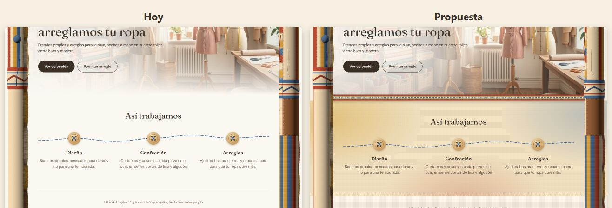
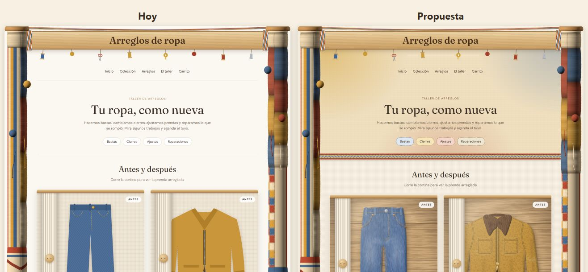
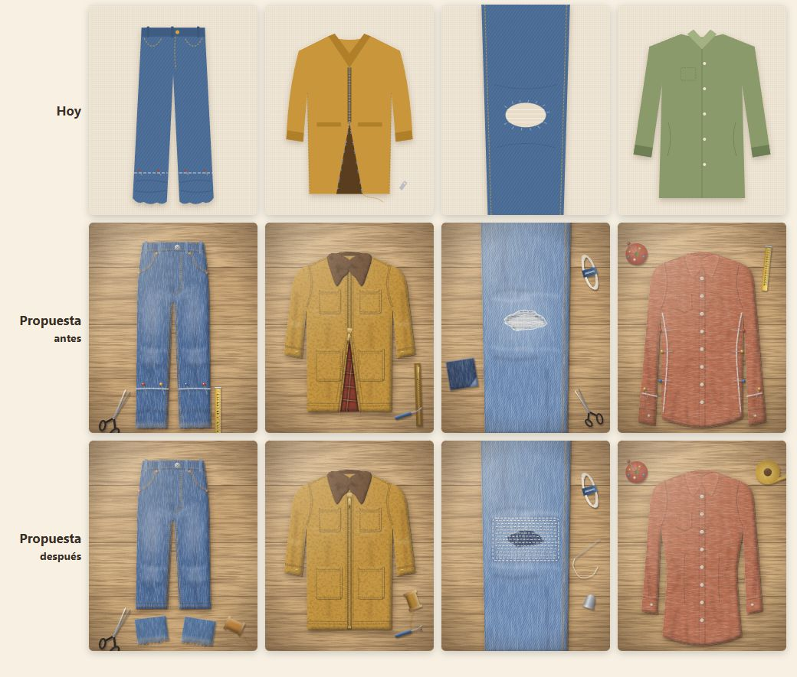
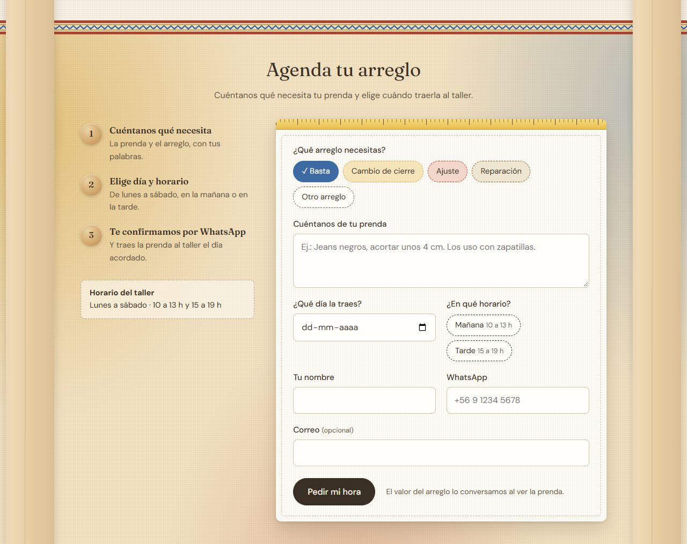
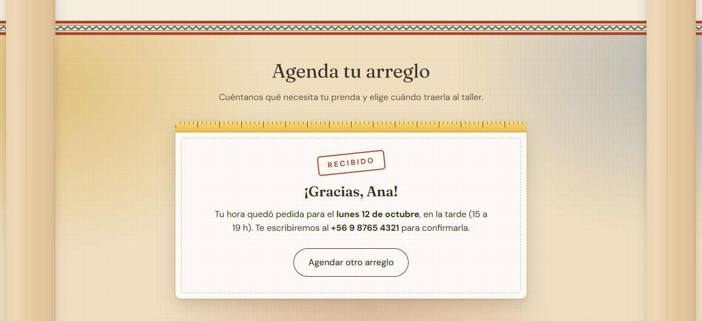
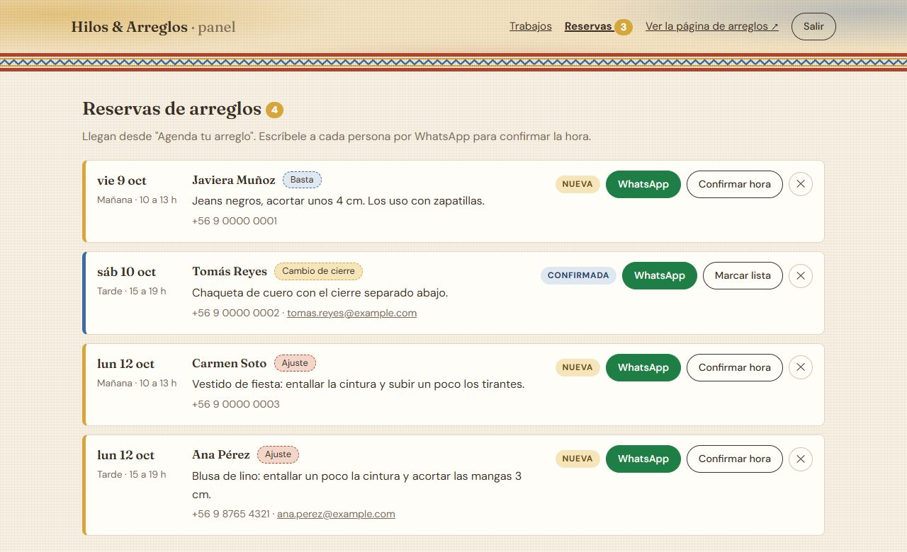
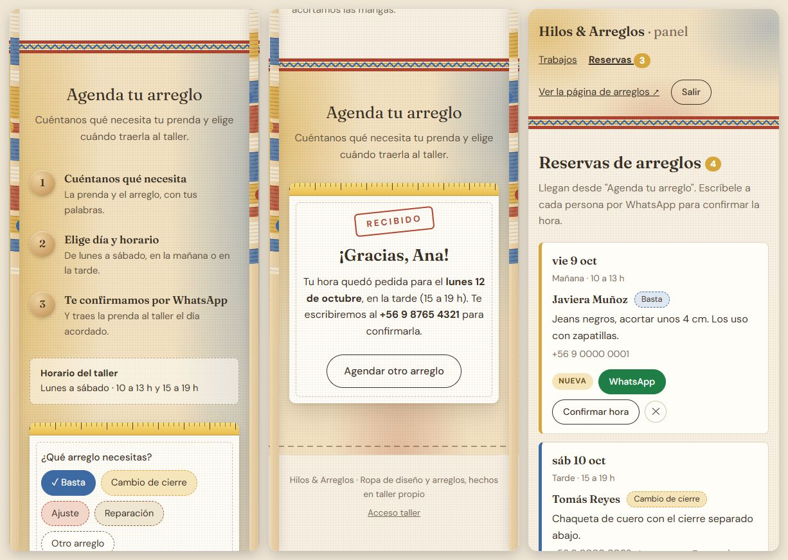

# Ideas para Hilos & Arreglos

Aquí juntamos los cambios que queremos hacerle a la página antes de programarlos,
para conversarlos entre los dos. Cada uno anota sus ideas en su sección y deja su
opinión en las del otro.

**Estados:** 💡 Propuesta · 💬 Conversando · ✅ Aprobada · ❌ Descartada · 🚀 Hecha

---

## Ideas de Camilo

### 1. Más color después de la portada

- **Página:** Inicio y Arreglos
- **Qué cambiar:**
  - La foto de la portada ya no se desvanece a blanco: termina en una **faja tejida** igual a
    la de los pilares (bordes rojos, franjas mostaza y zigzag azul).
  - "Así trabajamos" y "Agenda tu arreglo" van sobre una franja de **lino tostado con luces
    de los colores de las lanas** (mostaza, rojo y azul) y un pespunte abajo.
  - En Arreglos, la portada lleva ese mismo fondo de color, y los servicios (Bastas, Cierres,
    Ajustes, Reparaciones) pasan a ser **parches cosidos**, cada uno de un color.
  - El fondo general pasa de casi blanco a un lino claro con una trama muy suave.
- **Por qué:** hoy la página se ve pálida al lado de los pilares, que son lo más colorido.
  Así ese color sigue en el contenido.
- **Estado:** 🚀 Hecha
- **Opinión de Max:** la juntó con `main` el 8 de octubre.





### 2. Ropa más realista en "Antes y después"

- **Página:** Arreglos
- **Qué cambiar:** reemplazar los dibujos planos por ilustraciones más realistas: cada prenda
  sobre la mesa de madera del taller, con textura de tela, volumen, costuras y remaches, y las
  herramientas de cada arreglo.
  - **Antes:** se ve el problema marcado: tiza y alfileres donde se corta la basta, el cierre
    roto con el forro asomando, el hoyo deshilachado, la camisa holgada marcada para entallar.
  - **Después:** el trabajo listo: basta nueva con los pedazos cortados al lado, cierre nuevo,
    parche con puntadas sashiko, camisa entallada con pinzas y mangas más cortas.
  - La camisa pasa de verde a terracota, para que las cuatro prendas usen los colores de las lanas.
- **Por qué:** los dibujos actuales se ven muy de caricatura al lado de la foto de la portada.
- **Ojo:** siguen siendo ilustraciones. Lo ideal a futuro es cambiarlas por fotos reales de
  trabajos del taller.
- **Estado:** 🚀 Hecha
- **Opinión de Max:** la juntó con `main` el 8 de octubre.



### 3. "Agenda tu arreglo" que funciona, con las reservas en el panel

- **Página:** Arreglos y panel
- **Por qué:** la sección decía "Muy pronto podrás reservar tu hora". Para mostrarle la demo a los
  talleres a los que les ofrecemos la página, conviene que se pueda probar el recorrido completo:
  **el cliente pide hora → el taller la ve en el panel → le escribe por WhatsApp**.
- **Qué cambia para el cliente:**
  - Un formulario con forma de **ficha de taller** (huincha de medir arriba y pespunte por dentro).
    Se elige el arreglo (los mismos parches de colores), se cuenta qué necesita la prenda, el día
    (de mañana a 60 días, sin domingos), mañana o tarde, nombre, WhatsApp y correo opcional.
  - Al enviar, la ficha queda **timbrada "Recibido"** con el día y el número al que se le escribirá.
  - Si algo falta, se marca en rojo sin perder lo escrito.
  - Los servicios de la portada (Bastas, Cierres…) llevan al formulario con ese arreglo ya elegido.
- **Qué cambia para el taller:** en el panel aparece **Reservas** (con el número de nuevas en el
  menú). Cada reserva tiene un botón de **WhatsApp con el mensaje ya escrito**, y botones para
  pasarla de *Nueva* a *Confirmada* y a *Lista para retirar*, o borrarla. Parte con 3 reservas de
  muestra para que la demo no se vea vacía.
- **Detalles técnicos (para Max):**
  - Tabla nueva `reservas` en `tienda.db`; se crea sola al iniciar, como las otras.
  - Usa tu mismo CSRF. Si la sesión venció, al cliente se le devuelve el formulario lleno en vez
    de mandarlo al login del panel.
  - Todo se revisa también en el servidor (`leer_reserva` en `main.py`), y hay un campo escondido
    que solo llenan los robots (si viene lleno, no se guarda nada).
  - Archivos: `main.py`, `templates/arreglos.html`, `templates/admin/reservas.html` (nuevo),
    `templates/admin/base_admin.html`, `static/css/estilos.css` y `static/css/admin.css`.
- **Para más adelante:** avisarle al taller por correo cuando llegue una reserva, y dejar que el
  cliente adjunte una foto de la prenda.
- **Estado:** 🚀 Hecha
- **Opinión de Max:** aprobada, está buena. La juntó con `main` el 8 de octubre.

**Lo que ve el cliente:**





**Lo que ve el taller en el panel:**



**En celular** (formulario, confirmación y panel):



---

## Ideas de Max

_Si quieres, agrega las tuyas aquí, con el mismo formato._

---

<details>
<summary>Formato de cada idea</summary>

```markdown
### 1. Título corto de la idea

- **Página:** Inicio / Arreglos / Colección / Todas…
- **Qué cambiar:** lo que se quiere hacer.
- **Por qué:** qué problema resuelve o qué mejora.
- **Estado:** 💡 Propuesta
- **Opinión de Max:** _(pendiente)_
```

En las ideas de Max, la última línea es **Opinión de Camilo**.

</details>
